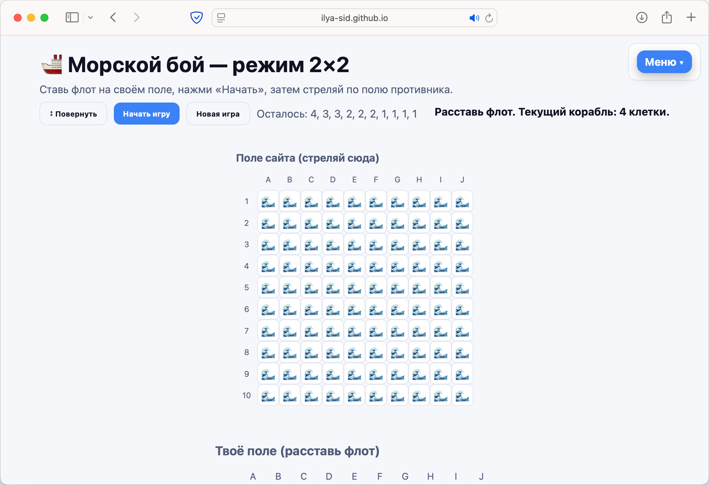
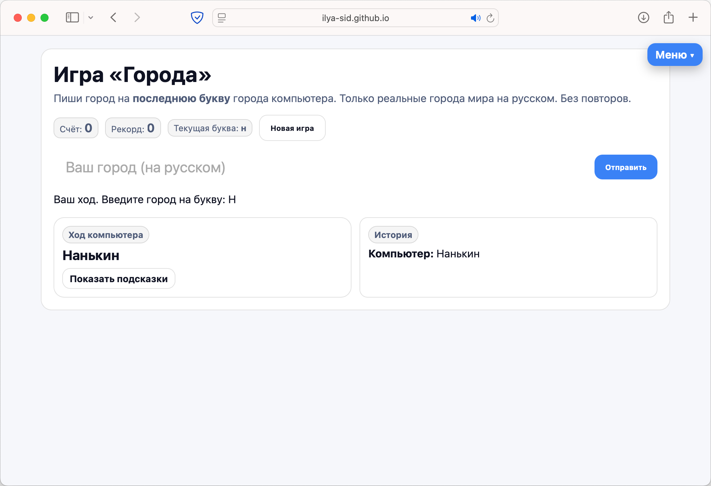
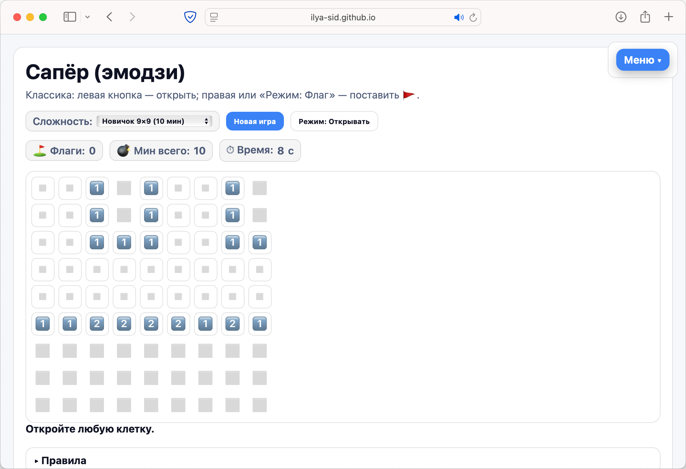
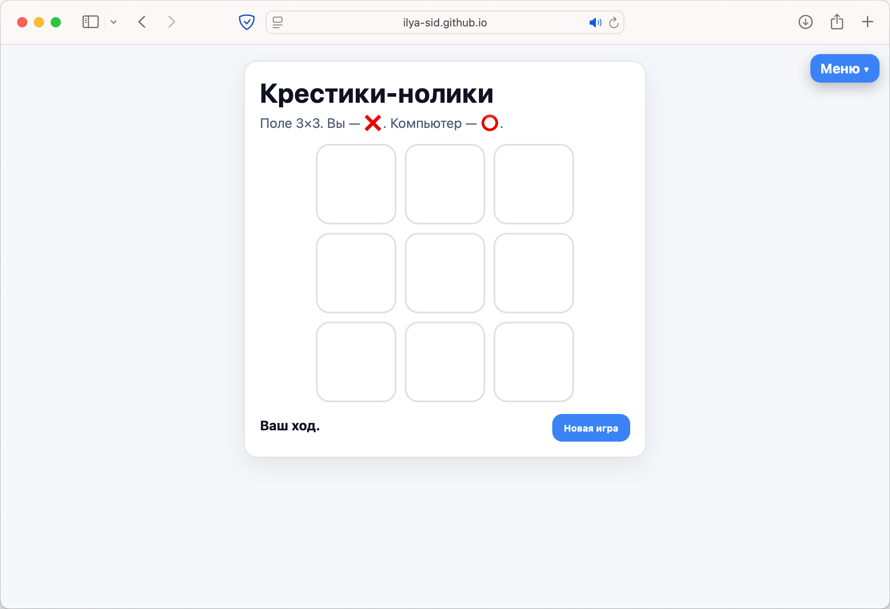

# 🎮 Набор мини-игр на HTML + JS + CSS

Небольшая коллекция классических игр в браузере — без фреймворков, только чистый HTML, CSS и JavaScript.  
Все игры работают прямо в браузере, ничего устанавливать не нужно.

## 📋 Игры

- ⚓ **Морской бой** — классическая стратегия 10×10.  
- 🏙 **Города** — игра в слова, где нужно называть города.  
- 💣 **Сапёр** — эмодзи-версия с уровнями сложности (9×9, 16×16, 30×16).  
- ❌⭕ **Крестики-нолики** — 3×3 с «непобедимым» ИИ.  
- 📚 **Примеры** — демонстрационная страница с базовой версткой.

## 🚀 Как открыть

1. Сайт доступен онлайн через [GitHub Pages](https://ilya-sid.github.io/games/index.html)  
2. Локально: просто открой любой `.html`-файл в браузере (например, `index.html`).

## 🎨 Темы оформления

Все игры поддерживают тёмную, светлую и «системную» тему.  
Переключатель доступен в выпадающем меню сайта.

## 📷 Скриншоты

### Морской бой

### Города

### Сапёр

### Крестики-нолики

---

✨ Проект сделан ради практики и удовольствия.  
Буду рад идеям и предложениям!
